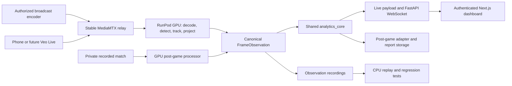

**RTGS architecture review and launch roadmap — September 8, 2026**

Implementation follow-up: the team selected a browser-controlled CanadaWest account integration. See [the implemented pilot, deployment steps, and remaining acceptance gate](canadawest-live.md). The review below records findings before implementation; its source priorities are superseded by that choice.

Recommendation: retain the shared analytics engine and existing RunPod deployment. Validate a downloaded match immediately, obtain a feed from the Canada West broadcast production path, and launch an analyst-operated pilot. Veo Live should be an optional future source rather than a launch dependency.

This review covers local revision `2d1a0947`, including inspection of two existing untracked team-tracking files. No production code was changed. The team currently has no Veo Live subscription; camera model, broadcaster feed access, model accuracy on representative matches, and measured GPU performance remain unconfirmed. Live analysis remains the product; recorded analysis is the validation and review path unless product scope is explicitly changed.

**Where to obtain footage**

CanadaWest.TV is the current broadcast destination. Huskie Athletics' September 2026 women's soccer preview links to it, and Canada West's 2026 soccer announcement says its soccer games are available there. This establishes where to watch; it does not establish an ingest API or a feed available to RTGS. [Huskie Athletics preview](https://huskies.usask.ca/news/2026/9/3/huskie-womens-soccer-set-for-edmonton-road-trip-to-kick-off-2026.aspx), [Canada West announcement](https://canada-west.prezly.com/canada-west-reveals-2026-soccer-schedule).

| Priority | Source | Next action | Main limitation |
|---|---|---|---|
| 1: validation now | Existing Veo MP4 or athletics-supplied broadcast recording | Obtain a representative private clip and one complete match; run the existing post-game harness | File availability, camera framing, and broadcast edits |
| 2: preferred live pilot | Feed supplied by Huskie Athletics or the host broadcast crew | Request a second encoder output or private feed, preferably an uninterrupted wide camera | Requires the producer's cooperation; away matches may use different crews |
| 3: conditional fallback | Provider-supplied CanadaWest.TV stream access | Confirm machine access, authentication, URL renewal, and measured delay | A viewer page is not a media URL; finished broadcasts may contain replays and cutaways |
| 4: independent fallback | Dedicated phone/camera publishing to the relay | Use the existing phone workflow if athletics cannot supply a feed | Separate mounting, power, network, and framing work |
| Later | Veo Live custom destination | Add when the team subscribes and the camera/plan supports it | Compatibility and latency require an actual test |

The useful first contact is the athletics sports information/digital content group through the coach. The current directory lists Elliot Gabler as Sports Information Coordinator and Darnell Wyke as Digital Content Coordinator; these are routing contacts, not confirmed broadcast engineers. [Huskie Athletics directory](https://huskies.usask.ca/staff-directory).

Suggested request, for the team to send:

> We are developing an internal analysis tool for Huskie women's soccer. Who produces the CanadaWest.TV home broadcasts? Can RTGS receive an authorized second encoder output or private feed, ideally from the uninterrupted wide camera, and one full-match MP4 for testing? We need the feed format, resolution/frame rate, expected delay, access method, and the process for away games.

Veo's standard download is an MP4 of the follow-camera view; panoramic/interactive views are not downloadable through that workflow. Verify the team's download entitlement. This is suitable for an initial model test, but cannot establish full-field coverage. [Veo download guide](https://support.veo.com/hc/en-us/articles/4451733961361-How-to-download-your-Veo-recordings).

Veo documents custom destinations using an RTMP URL and stream key. RTGS currently accepts only encrypted RTMPS on its relay, so test the exact protocol, port, and credential format before assuming compatibility. Veo also warns that a custom stream can take up to 60 seconds to appear; its own viewer guidance describes roughly 60 seconds of action-to-screen delay. Neither establishes the latency of a future private RTGS feed. [Custom destination guide](https://support.veo.com/hc/en-us/articles/27024186793745-How-to-livestream-to-a-custom-destination-using-Veo-Live), [Veo live guide](https://support.veo.com/hc/en-us/articles/21867641878929-How-to-livestream-with-Veo-Cam).

**Architecture to keep**

The live implementation uses Roboflow's native `get_model(...).infer(...)`, so model execution happens on the machine running Python. Training/hosting a model in Roboflow does not move those calls off the local machine. Put detection, keypoints, team classification, tracking, and projection together on the GPU host. Keep the analyst laptop responsible for the browser and session controls. Roboflow documents the distinction between native execution and its HTTP inference client. [Roboflow Inference documentation](https://inference.roboflow.com/using_inference/about/).

The strongest existing design choice is the `FrameObservation` boundary and single [analytics engine](../backend/analytics_core.py). Preserve its canonical coordinates, team/direction rules, quality statuses, and operator-reviewed events. The [live payload](../backend/live_payload.py) and [post-game adapter](../backend/postgame/shared_adapter.py) are appropriate delivery layers. Observation replay lets developers change metrics and UI without repeatedly paying for vision inference.

The stable relay also makes sense: a broadcaster can publish to the same address while GPU pods change. For one team, the current container containing GPU processing, FastAPI, nginx, and Next.js is a practical pilot deployment. Splitting everything into services would add launch work. Keep SQLite for the single-worker report harness, and continue using a prebuilt commit-tagged image.

The important separation to add soon is **durable match data versus disposable compute**. Use run-specific directories and periodic finalized observation chunks, state snapshots, and reviewed-event exports to durable storage. Model caches and match archives have different lifecycles. Eventually a persistent dashboard/report service can survive GPU shutdown; that is not a prerequisite for a supervised pilot with verified exports.

**Findings in the actual implementation**

The local guide describes several optimizations as complete, but the inspected live loop does not contain them. Treat documentation and passing unit tests as insufficient evidence of deployed CV behavior.

| Priority | Evidence | Consequence and recommended change |
|---|---|---|
| Before paid unattended use | [cloud.py](../scripts/cloud.py): `create_pod()` creates the pod and waits for HTTP before returning into the caller's cleanup `try/finally` | Gateway timeout can leave a billable pod. Establish cleanup ownership immediately after creation; record the pod ID, retry deletion, and add a watchdog independent of the operator laptop. A mocked timeout reproduced zero delete calls. |
| Before live acceptance | [soccer_analytics.py](../backend/soccer_analytics.py): `/health/ready` returns HTTP 200 even with `ready=false`; `wait_http()` checks only status | Smoke tests can proceed before inference is ready. Use a non-ready status or explicitly inspect the JSON readiness flag. Separate process liveness, warmed models, source freshness, and usable analytics. |
| Before promising replayable exports | Live artifact route archives the observation gzip while its writer remains open | Flushing does not finalize gzip. A local reproduction raises `EOFError` before close and succeeds after close. Finalize/rotate recording chunks under a lock before export, and verify the downloaded archive can be replayed before deleting the pod. |
| Before selecting the final GPU/settings | Live team classification runs on player crops before ByteTrack; keypoints run on every processed frame; pitch/Voronoi images are still constructed in headless mode | Wire in tracking before team assignment, classify only unlocked tracks, schedule keypoints, and skip diagnostic rendering. The existing untracked `team_tracking.py` helper is not imported by the live runtime. |
| Before using a moving broadcast camera | Live homography averages recent transforms, but lacks a camera-cut reset and drops frames with fewer than four landmarks before publishing observations | Add camera-motion/cut handling, emit explicit unavailable observations, and prevent stale transforms from projecting a new view. Reuse transforms only while valid. A fixed 15-frame refresh interval alone is unsafe during pans/zooms. |
| Before trusting quality labels | `visible_pitch_fraction` is currently a landmark hull's fraction of image area, not a measured fraction of the pitch; failed calibration frames can bypass the engine | Current coverage can misrepresent usable match time and field visibility. Measure quality over elapsed source time, record gaps, and derive field visibility from calibrated geometry or report it unavailable. |
| Before trusting team statistics | Live calibration duplicates too few crops or substitutes blank crops; live uses SiGLIP while post-game uses jersey brightness | Require sufficient real samples, verify the USask/team mapping visually, expose retry/unknown states, and compare both CV paths on the same kits. Shared analytics does not guarantee matching vision observations. |
| Before a full-match rehearsal | `cloud soak` aliases `cloud_test`; live WebSocket sampling stops after about 50 seconds; post-game timeout is fixed at 20 minutes | Implement a duration-aware soak with warmup excluded from throughput measurement, disconnect/recovery exercises, resource monitoring, and final artifact validation. |
| Before processing full recorded matches through the browser | nginx limits uploads to 300 MB and `RTGSHTTP.upload()` reads the entire file into memory | Use a resumable/direct-to-storage transfer or controlled file staging; do not treat the short-clip upload endpoint as a full-match ingestion system. |

Additional work with direct product impact:

- **Freshness and timing:** `cap.read()` and inference run sequentially; setting OpenCV's buffer size is not proof that latency is bounded. Use a bounded latest-frame capture queue for live input, source timestamps, read timeouts, and gap accounting. File processing should preserve its ordered sample sequence. Current last-frame age measures processing freshness, not camera-to-dashboard delay.
- **Match controls:** live observations attach the operator's current wall-clock phase and clock. A delayed feed can therefore assign frames to the wrong half or stop before the final sequence arrives. Bind phase changes to the video timeline and drain delayed footage before final export/shutdown. Broadcast replay segments also need exclusion to avoid counting an event twice.
- **Recovery:** operator state is persisted, but the analytics engine starts empty and observations use a fixed filename opened for writing. A volume alone does not restore a running match. Introduce run IDs, append/rotation rules, and a tested replay/checkpoint recovery process.
- **GPU validation:** verify both detection/keypoint execution providers and team-classifier device. A CUDA-capable PyTorch install alone does not prove ONNX models use the GPU. Persist all model caches intentionally and start before kickoff.
- **Maintenance:** the post-game processor still computes legacy possession/events/shape before emitting the shared adapter's batch. Remove unused calculations incrementally, with replay parity checks. Extract source capture and vision orchestration from the large live file without duplicating analytics.

**Compute recommendation and cost**

Start with the already-targeted **single RTX 4090, 24 GB, on-demand RunPod Secure Cloud pod**. This is a benchmark starting point, not a claim that the current pipeline meets its throughput target. Match day is a continuous, stateful video job; one long-running process is simpler than per-frame serverless requests. Keep the model warm throughout a match and terminate after verified export. Evaluate a cheaper GPU only after obtaining representative throughput, latency, memory, and accuracy measurements.

RunPod currently lists the Secure Cloud 4090 at approximately **US$0.74/hour**. At that rate, three hours of GPU time is **US$2.22**, and twenty three-hour sessions are **US$44.40** of compute. These are arithmetic estimates, not a complete operating budget: add testing, relay hosting, storage, connectivity, any video subscriptions, and applicable taxes. Actual available inventory and price must be checked at deployment. [RunPod pricing](https://www.runpod.io/pricing).

Your current computers can continue to run the CPU replay suite and dashboard development. There is no immediate need to buy a workstation. Managed HTTP inference is an alternative if operating the container proves problematic, but it would still leave tracking, video ingestion, calibration, analytics, and state to operate. Keep that alternative out of the launch critical path.

**What the first release should promise**

An analyst-operated dashboard with team names, operator score/clock, stream health, possession over observable play, entries, and reviewable shot candidates. Mark xG provisional until both shot detection and its estimates have been checked against this competition's footage. Tracking IDs are temporary identities, not player names or jersey numbers.

Do not infer invisible players from a moving camera. Whole-team width, defensive line, pressing, and player distance totals need stronger evidence than a cropped broadcast supplies. Existing shape gating is a useful start, but its visibility input needs correction. Hide or clearly mark unsupported metrics. Validate on USask women's matches with the actual camera angle, distant ball size, kits, lighting, occlusion, pans, and goalmouth action.

For a finished broadcast, use the term delayed match analysis until measured latency supports a stronger promise. The repository's under-three-second target requires an actual source-to-dashboard measurement; a larger GPU cannot remove delay already introduced upstream.

**Execution roadmap**

Estimates below assume one developer familiar with the repository, an available GPU account, and prompt footage access. They describe a supervised pilot; broadcast access and CV quality can extend them.

| Stage | Work | Exit condition |
|---|---|---|
| Days 1–2: obtain evidence | Coach/athletics supplies a 5–10 minute representative clip and full match; identifies home producer and away-feed process. Developer fixes cleanup/export readiness issues before paid validation. | A replayable GPU-produced observation file, reviewed sample outputs, and an actual feed access plan. |
| Days 2–4: benchmark vision | Run both current CV paths on the same clip. Record stage timing, CUDA providers, ball/player recall samples, projection error, kit mapping, and coverage. Integrate the missing low-risk optimizations. | Chosen GPU/settings and a documented set of metrics accurate enough for analyst review. |
| Days 4–7: connect a live source | Use producer feed if supplied, otherwise the existing dedicated-camera path. Implement bounded capture, video-time controls, gap handling, and measured delay display. | Stable statistics without increasing backlog, tested phase transitions and reconnects, and declared source-to-dashboard latency. |
| Week 2: full-match rehearsal | Fix the soak workflow; test at least a complete match duration including halftime, source interruption, client reconnect, export, and shutdown. Analyst compares events to manual review. | No unexplained duplicate events, no silent coverage gaps, replayable exports, successful pod termination, and an agreed pilot metric set. |
| After pilot | Durable archive/recovery, easier session launch, authorized feed renewal, optional Veo Live input, broader model training from observed failures. | Coaches can operate the workflow reliably; new metrics have measured supporting evidence. |

Suggested acceptance gates: retain the existing eight unique processed payloads/second as an initial engineering target after warmup, but separately test whether that sampling rate preserves short ball events. Require no growing backlog, explicit unavailable intervals, verified team mapping/directions, and manual review of annotated sequences. Record event precision/recall and agree thresholds with the analyst before presenting events as reliable; do not invent accuracy numbers from synthetic fixtures. For any under-three-second claim, measure that delay at the actual venue and include upstream video delay.

**Verification performed for this review**

`./rtgs test` completed successfully: 32 backend tests, four frontend tests, production compilation/typechecking/route generation, and script checks. The existing tests include the untracked team helper but do not establish its integration into live CV. Two small local reproductions confirmed the gateway-timeout cleanup gap and unfinished-gzip export behavior. No paid pod, private broadcast session, or real CV benchmark was run. Those are the next evidence-producing steps, not outcomes already demonstrated by this review.
