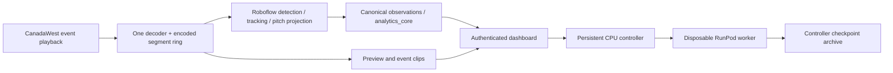

# CanadaWest live pilot

RTGS now has a managed CanadaWest source path. The analyst pastes an event link into the dashboard; a persistent controller creates a disposable RunPod GPU worker, which signs in to CanadaWest, discovers playback, runs the existing Roboflow models, and sends canonical observations through `analytics_core.py` to the dashboard.

**Status:** local contracts, synthetic decoding/clips, recovery, and the frontend build are tested. Actual CanadaWest login/playback, the GPU image, and model accuracy on these broadcasts still require validation. Do not schedule this as the team's sole match-day analysis system until the acceptance gate below passes. No paid pod or real account session was created during implementation.



The controller owns the session database, deadline, pod ID and latest validated checkpoint. Closing a browser does not end the match. Stop waits for finalization before deletion, with a two-minute finalization timeout that retains the last checkpoint. Pod creation is recorded before the cloud request so a controller restart can adopt a matching pod. A controller outage still requires an operator to check RunPod: the worker stops processing at its deadline, but a running pod remains billable until the controller or operator deletes it.

## Administrator setup

1. Run `./rtgs test`, commit the intended revision, and let the existing test-gated GPU workflow publish `ghcr.io/elleowo/realtimegamestatistics:<full-40-character-sha>`. The managed controller refuses a floating tag or `{sha}` placeholder. Publishing and deployment have not been performed as part of local implementation.
2. Prepare a persistent Linux host with Docker Compose, a domain pointing to it, and ports 80/443 available. The CPU host serves the dashboard and controller; inference stays on RunPod. The controller image includes no models or browser automation runtime.
3. Create a private environment file outside the checkout, mode `0600`, containing:

   ```dotenv
   RUNPOD_API_KEY=...
   ROBOFLOW_API_KEY=...
   RTGS_CANADAWEST_EMAIL=...
   RTGS_CANADAWEST_PASSWORD=...
   RTGS_GPU_IMAGE=ghcr.io/elleowo/realtimegamestatistics:FULL_COMMIT_SHA
   RTGS_OPERATOR_USER=rtgs
   RTGS_OPERATOR_TOKEN=LONG_RANDOM_DASHBOARD_PASSWORD
   # Optional: persistent model cache and private registry credentials
   # RUNPOD_NETWORK_VOLUME_ID=...
   # RUNPOD_CONTAINER_REGISTRY_AUTH_ID=...
   # RUNPOD_GPU_TYPE_IDS=NVIDIA GeForce RTX 4090
   ```

4. From the checkout on that host:

   ```bash
   export RTGS_ENV_FILE=/secure/path/rtgs.env
   export RTGS_DOMAIN=rtgs.example.com
   docker compose -f deploy/control/compose.yml up -d --build
   ```

   Open the HTTPS domain and sign in with the dashboard credentials. Caddy obtains TLS; nginx protects the dashboard, API, previews, clips and WebSocket with Basic authentication. RunPod gets a separate random credential per session. The persistent `control-data` volume contains recovery data; back it up and preserve it during upgrades. Do not use `docker compose down -v` on a live installation.

5. Paste a CanadaWest event URL and start the pilot. Credentials stay server-side. This path does not require Veo Live or the MediaMTX relay. The older `./rtgs cloud live` command continues to use the phone/relay workflow.

## Match-day operation

1. Start early enough for GPU boot, model loading, login, and kit calibration. The session initially permits no accumulation.
2. Use the backend preview to identify USask's blue-box `0` or pink-box `1` cluster. Confirm teams, set names and first-half direction, then select 1H and enable accumulation at kickoff. Team confirmation must be repeated after recovery onto a fresh worker.
3. Statistics and operator commands use the processed video's timeline. The displayed clock freezes when frames stop arriving; it does not pretend to measure action on the field in real time. Broadcast delay remains unknown. Processing and queue delay exclude broadcaster latency.
4. Pause accumulation during replays, close-ups and cutaways. If a replay was missed, exclude its start/end video seconds; RTGS rebuilds analytics from recorded observations. Camera-change detection resets tracking/calibration, but is a heuristic and cannot reliably identify every replay.
5. Review shot candidates. Confirm or reject them, correct the team/on-target field, and mark actual goals. Only confirmed/corrected shots contribute to the displayed shot/xG totals. Goal reviews adjust the operator score; xG never supplies the score. A clip link appears only after its MP4 is complete; missing clips remain explicit. Clips use the same upstream packets, contain video only, and boundaries follow encoder keyframes.
6. Set halftime and second half explicitly. The direction selector configures the second half opposite the first. Use the existing match controls for corrections.
7. The initial deadline is three hours. Add one hour if needed. End the session, wait for cleanup, and download its checkpoint. If interrupted, wait for cleanup, then Resume; the prior checkpoint is restored before decoding begins. Missing footage between checkpoints/reconnection is a gap, not invented statistics.

## Acceptance gate before a real match

- Test the team's actual event entitlement. The connector uses normal Playwright login and intercepts an HLS/DASH manifest, then closes the browser page before decoding. It does not bypass DRM, challenges or subscription restrictions. The current selectors and the manifest format are unverified on an authenticated CanadaWest session; account access alone does not establish compatibility.
- Confirm login, upcoming-event waiting, available playback, expired URL refresh, disconnect/reconnect, Stop, and device-limit messaging. CanadaWest documents a two-device allowance; verify the applicable plan and leave capacity for the analyst. See [CanadaWest simultaneous logins](https://support.canadawest.tv/support/solutions/articles/154000182110-how-many-logins-am-i-allowed-).
- Verify both models use GPU execution, kit clusters remain stable, and semantic field landmarks project correctly across pans. Run a representative half with replays and camera cuts. Check frame age, queue delay and memory over that entire period. Measure broadcast-to-dashboard delay separately.
- Compare possession, entries and reviewed shots with manual coding on a representative clip. Treat xG as provisional until checked. Broadcast framing hides players and the ball; advanced shape, transition and pressure panels remain hidden in managed mode. Goalkeepers are currently omitted from the broadcast vision adapter, which can reduce possession coverage around goalkeeper involvement.
- Kill/restart the worker and controller during a test, restore a checkpoint, and verify reviews, score and source clock survive without duplicate events. Confirm the pod disappears from RunPod after Stop and deadline cleanup. The free tests exercise these contracts with fake cloud responses; they do not prove the provider's behavior.

## CPU regression and recovery inspection

Run `./rtgs test`. Tests include generated, non-identifying video for the actual decoder/remuxer; install `ffmpeg` locally. No footage is committed. An archive contains `timeline.jsonl`, a closed `observations.jsonl.gz`, `run-summary.json`, and available event clips. Source frames and full match recordings are not exported.

Extract `observations.jsonl.gz` from a private checkpoint, then run:

```bash
PYTHONPATH=backend .rtgs/local/venv/bin/python backend/replay_server.py \
  --recording /secure/path/observations.jsonl.gz --speed 1 --port 8001
```

The recording header selects the broadcast adapter automatically. It uses the same source-time controls, gaps, exclusions and stable event IDs as the GPU runtime. A checkpoint with no processed frames can be restored but cannot be played as a video-free replay yet.

## Implementation boundaries

- `canadawest.py`: isolated playback discovery and sanitized errors.
- `broadcast_source.py`, `packet_ring.py`: bounded latest-frame handoff and one upstream media consumer, with asynchronous clip packaging.
- `live_vision.py`: CUDA-only vision adapter, per-track team votes, semantic keypoints and scheduled homography refresh. Metrics remain in `analytics_core.py`.
- `broadcast_runtime.py`, `broadcast_replay.py`: source-time orchestration, corrections, durable journal and CPU reproduction.
- `broadcast_worker.py`: managed worker health/API/WebSocket, preview and compact exports.
- `live_sessions.py`, `control_server.py`: durable single-match lifecycle and authenticated gateway proxy.

MSA remains the post-game reporting source. The existing post-game harness, legacy relay runtime and legacy cloud soak command were not replaced by this integration. Corrections rebuild the recorded timeline in memory; measure their cost during the full-half acceptance test before relying on frequent corrections over a complete match.
